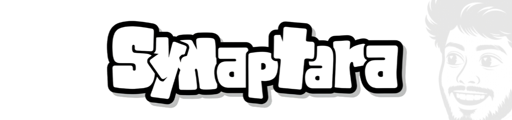
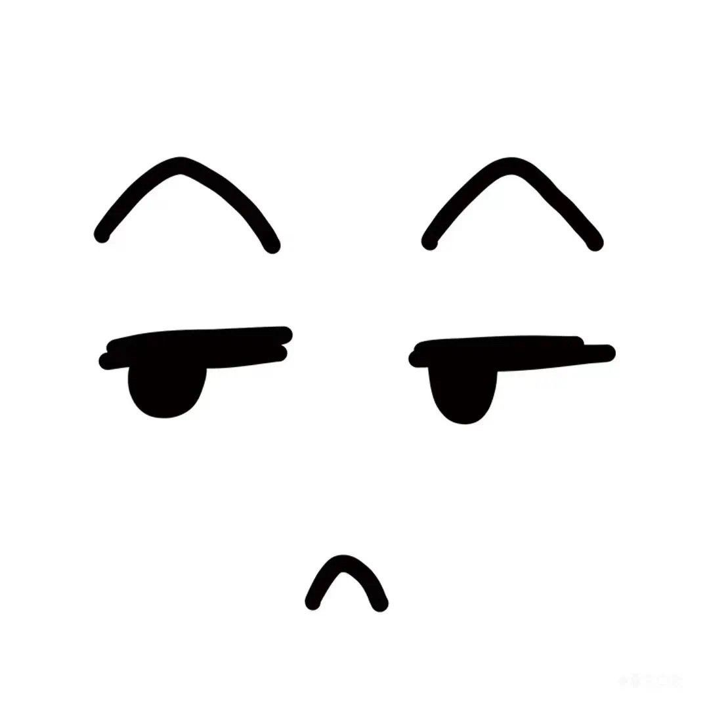

  

 

   &nbsp;
   &nbsp;
   &nbsp;
  

 

### Hey there! I’m Karthick 

<table width="100%" style="width: 100%;">
  <tr>
    <td>
      <b>Full-Stack Developer (React & Python/Django)</b> | Class of 2026  
      I am based in Trivandrum and deeply passionate about building end-to-end web applications. I love bridging the gap between robust, scalable backend architectures and highly interactive, minimalist user interfaces.  
      Currently, I'm focusing my energy on building <b>FileGhost</b> (a privacy-centric file-sharing platform) and <b>Updrop</b> (automation tools). My daily technical playground revolves around <b>React, Python, Django, and Tailwind CSS</b>. Whether it's designing secure RESTful APIs or crafting seamless frontend experiences, I enjoy turning complex problems into elegant web solutions.
    </td>
  </tr>
</table>

  <table width="100%" style="width: 100%;">
    <tr>
      <td width="75%">
         <b>Updrop Platform</b> 
         
        - Automated video scheduling app 
      </td>
      <td width="25%" rowspan="3" align="center" valign="middle">
        
      </td>
    </tr>
    <tr>
      <td>
         <b>FileGhost Application</b> 
         
        = Secure file sharing platform 
      </td>
    </tr>
    <tr>
      <td>
         <b>GenGhost Chatbot</b> 
         
        - Discord repository management bot 
      </td>
    </tr>
  </table>

